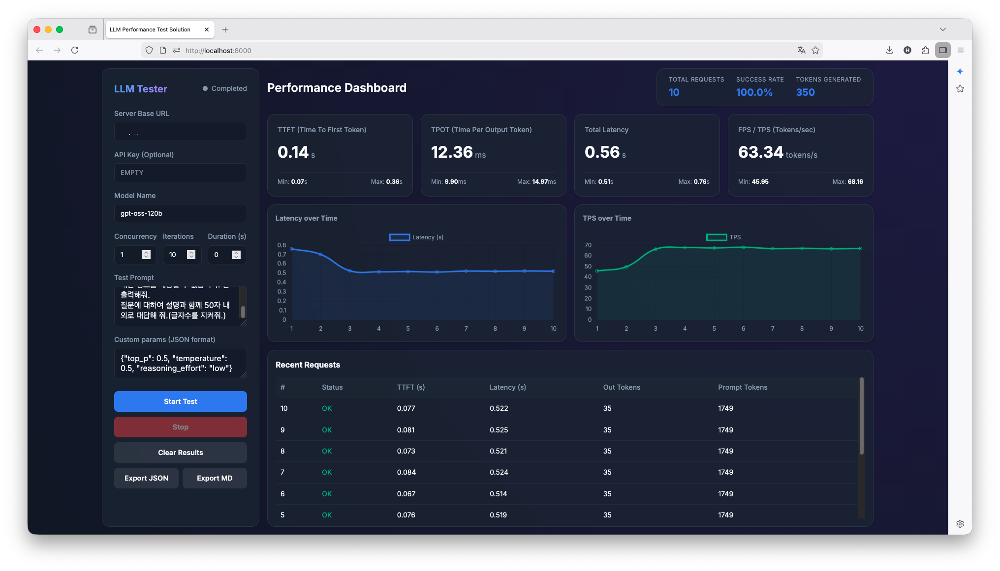

# LLM Performance Test

본 프로젝트는 내부 서버 또는 로컬 환경에서 구동 중인 대규모 언어 모델(LLM) 서빙 플랫폼의 실시간 텍스트 생성 성능과 부하 내구성을 간편하게 측정하고 시각화하기 위한 도구입니다.
Locust 같은 훌륭한 툴도 있지만, 작업하는 도중에 더 쉽게 하고 싶어서 Antigravity를 이용해서 개발했습니다.



## 주요 기능 및 특징 (Features)

- **주요 지표 측정**: LLM 추론 속도 평가에 필수적인 핵심 지표(TTFT, TPOT, Latency, TPS)를 실시간으로 집계 및 시각화합니다.
  - **TTFT (Time To First Token)**: 첫 생성 토큰 반환 대기 시간
  - **TPOT (Time Per Output Token)**: 출력 토큰 당 평균 생성 시간
  - **Latency**: 전체 응답 지연 시간
  - **TPS (Tokens Per Second)**: 초당 평균 토큰 생성 속도
- **비동기 부하 테스트**: 다수의 가상 사용자(Concurrency)를 동시 접속시켜 서버 스트레스를 검증합니다. 반복 횟수(Iterations)나 지속 시간(Duration limit) 설정에 따른 유연한 시나리오 구성이 가능합니다.
- **다양한 플랫폼 호환**: OpenAI 호환 API 규격을 따르는 주요 로컬 추론 프레임워크(vLLM, LiteLLM, Ollama, LM Studio 등)와 연동됩니다. 커스텀 API 파라미터(JSON)를 추가하여 모델 특화 설정도 주입할 수 있습니다.
- **직관적인 UI 대시보드**: 복잡한 터미널 명령어 조작 없이, 브라우저 상의 Glassmorphism 기반 다크모드 대시보드를 통해 비전문가도 쉽게 테스트를 실행하고 모니터링(`Chart.js` 연동)할 수 있습니다.
- **보고서 자동 생성**: 테스트 설정을 포함한 요약 보고서를 JSON 원본 포맷과 Markdown 보고서 형태 두 가지로 간편하게 로컬에 다운로드할 수 있습니다.

## 기술 스택 (Tech Stack)

- **Backend**: Python 3, FastAPI, `asyncio`, HTTPX (비동기 처리 최적화)
- **Frontend**: Vanilla JavaScript, HTML5, CSS3, Chart.js (모던하고 경량화된 UI 트렌드 반영)
- **통신 방식**: SSE(Server-Sent Events)를 이용한 실시간 단방향 메트릭 스트리밍 전송

## 폴더 구조 (Directory Structure)

```text
llm-speed-test/
├── backend/               # FastAPI 기반 성능 계측 및 부하 테스트 코어 로직 엔진
│   ├── llm_client.py      # 비동기 LLM API 통신 및 토큰 응답 스트림 파서
│   ├── load_tester.py     # 다중 동시 접속 생성 및 메트릭 집계(다중 워커 큐 관리)
│   ├── main.py            # API 라우팅 엔드포인트 및 앱 스캐폴딩 스크립트
│   └── requirements.txt   # 파이썬 의존성 패키지 목록
├── frontend/              # 클라이언트 웹 UI 리소스 모음
│   ├── app.js             # 뷰 제어, 폼 핸들링, SSE 통신 제어 로직 모듈
│   ├── index.html         # 대시보드 레이아웃
│   └── style.css          # 사용자 인터페이스 스타일 시트 리소스
├── docs/                  # 기획서(PRD) 및 개발/실행 로그, 에러 리포트 등 문서 집합
├── run.sh                 # 자동 설치 및 가동 통합 Shell 래퍼 스크립트
└── README.md              # 프로젝트 메인 안내서
```

## 시작하기 (Getting Started)

프로젝트를 실행하려면 파이썬(Python 3.8 이상 권장)과 `bash` 환경이 필요합니다. 저장소 초기화 및 필수 패키지 설치부터 프론트엔드/백엔드 서비스 기동이 쉘 스크립트 단일 명령어 하나로 자동 진행됩니다.

### 설치 및 실행

```bash
# 코드 다운로드
git clone https://github.com/HyungJiny/llm-performance-test.git

# 디렉토리 접근
cd ./llm-speed-test

# 패키지 설치 및 웹 서버 기동 (최초 1회에는 가상환경 구성이 포함되어 있습니다)
# 실행을 위해서는 Python 3.8 이상 환경이 필요합니다.
./run.sh
```

### 접속 방법
터미널에서 정상적으로 앱 스캐폴드가 로딩되었다면 브라우저를 열어 다음 주소로 접속합니다.
- **Main Dashboard**: `http://localhost:8000/`

## 사용 방법 (How to Use)
1. **서버 주소 설정**: LLM 서버의 기본 주소(Base URL)를 입력합니다.
2. **대상 모델 기입**: 벤치마킹을 수행하고자 하는 모델 명을 입력합니다.
3. **부하 파라미터 조작**: 동시 접속자 수(`Concurrency`), 생성 횟수(`Iterations`), 테스트 최대 시간(`Duration`)을 상황에 맞게 조정합니다.
4. **시작**: `Start Test` 버튼을 클릭합니다.
5. **모니터링 & 내보내기**: 테스트 과정을 우측 대시보드와 차트 패널에서 실시간으로 확인 후, 모든 테스트가 끝나면 `Export JSON` 혹은 `Export MD` 버튼을 클릭하여 테스트 환경과 결과를 다운로드하여 보관합니다. 다른 시나리오를 시작하고자 할 때는 `Clear Results`를 이용해 화면을 리셋합니다.

## 개발 문서 가이드
보다 자세한 구현 히스토리와 기획 의도는 다음 문서 폴더들을 참조 바랍니다.
- 기획서: `docs/bible/PRD.md`
- 구현 전략 및 설계도: `docs/plans/development_plan.md` 
- 마일스톤 실행 기록: `docs/logs/execution_log.md`
- 이슈 해결 기록: `docs/errors/error_report.md`
